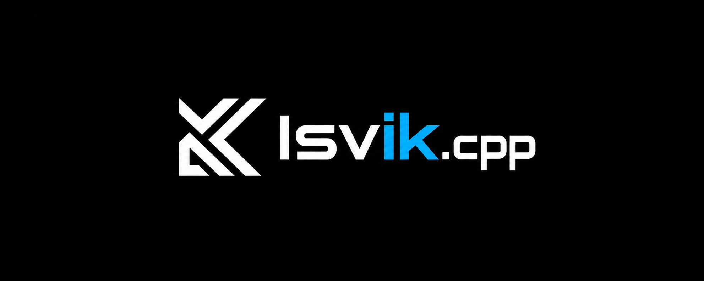

# Isvik.cpp

<p align="center">
  
</p>

<p align="center">
  <a href="https://github.com/AbyssGG/Isvik" title="原版 Isvik 项目">
    <picture>
      <source media="(prefers-color-scheme: dark)" srcset="resources/isvik-lockup.png">
      
    </picture>
  </a><br>
  <sub>原版 Isvik 标识 · © 2026 AbyssGG</sub>
</p>

<p align="center">
  <strong>围绕 OpenVINO 开发，为 Intel AI PC 提供本地 AI 运行环境。</strong><br>
  C++20 · OpenVINO GenAI · 可选 ONNX 支持 · 桌面聊天 · 交互式 CLI · 本地 API
</p>

<p align="center">
  <a href="CMakeLists.txt"></a>
  <a href="docs/MODEL_SUPPORT.md"></a>
  <a href="docs/MODEL_SUPPORT.md"></a>
  <a href="docs/BUILDING.md"></a>
  <a href="docs/TENSORRT_GGUF.zh-CN.md"></a>
  <a href="LICENSE"></a>
  <a href="https://github.com/AbyssGG/Isvik.cpp/actions/workflows/ci.yml"></a>
</p>

<p align="center">
  <a href="README.md">English</a> | <strong>简体中文</strong>
</p>

## Isvik.cpp 是什么？

Isvik.cpp 是专门为在 Intel AI PC 上使用 OpenVINO 语言模型推理而设计的 C++20 本地 AI 运行时，提供桌面聊天界面、可持续交互的双语 CLI、模型库、记忆存储和本地 API 服务。推理在你的设备上运行，无需云端账户。可选的 ONNX Runtime GenAI 后端支持兼容的模型包；NVIDIA TensorRT 是实验性集成。

## 为 Intel AI PC 使用 OpenVINO

项目最初的目标是让 OpenVINO 语言模型推理可以直接在桌面程序和真正的终端中使用，并通过 API 调用同一个本地模型。OpenVINO GenAI 是运行 OpenVINO IR，以及当前安装版本所支持的 GGUF 模型的主要路径。模型与设备支持时，可以选择 CPU、Intel GPU 或 NPU。

模型库、聊天、CLI 和 API 共用同一套运行服务。你可以检查模型、选择设备，再从适合自己的入口使用。具体兼容限制见[模型支持说明](docs/MODEL_SUPPORT.md)。

## 可用后端

| 后端 | 定位 | 模型输入 | 运行设备 |
| --- | --- | --- | --- |
| OpenVINO GenAI | 主要运行时 | OpenVINO IR 和部分 GGUF 模型 | 受支持的 CPU、GPU 或 NPU |
| ONNX Runtime GenAI | 可选 | 兼容的 ONNX 文本生成模型包 | 构建中可用的执行提供程序 |
| NVIDIA TensorRT | 实验性 | 通过 Isvik 原生插件运行受支持的 Gemma 4 GGUF | NVIDIA GPU |
| TensorRT-RTX 执行提供程序 | 可选 | 兼容的 ONNX Runtime GenAI 模型包 | 受支持的 NVIDIA GPU，可按配置回退 |

识别到模型不代表一定能推理。架构、张量编码、分词器文件、已安装的 SDK 和所选设备都会影响兼容性。TensorRT GGUF 实现目前仅支持部分模型，且存在已知速度问题，仍在开发中。详见[模型支持说明](docs/MODEL_SUPPORT.md)。

## 版本

**Isvik.cpp 当前源码版本是 0.1.0**，与 [CMake](CMakeLists.txt) 和 Windows 可执行文件资源中的版本一致。它表示当前源码版本；目前尚未发布 GitHub 二进制发行版。

| 组件 | 仓库使用的版本 |
| --- | --- |
| OpenVINO GenAI 及其随附运行时（Windows） | `2026.4.0.0` |
| ONNX Runtime GenAI（Windows） | `0.17.0` |
| ONNX Runtime（Windows） | `1.26.0` |
| Slint C++ | `1.18.1` |
| TensorRT-RTX 执行提供程序 ABI（可选，Windows） | `0.4.2` |
| TensorRT SDK 与 CUDA Toolkit（可选） | 使用本机安装的版本；不固定补丁版本 |

固定依赖版本在 [CMake 集成文件](cmake/)中定义。构建时只有找到所需 SDK，才会包含对应的可选后端。

## 开始使用

### 在 Windows 上构建

安装含 C++ 工作负载的 Visual Studio 2026、CMake 3.21 或更高版本，以及 Git。在仓库根目录运行：

```powershell
cmake --preset windows-msvc-release
cmake --build --preset windows-msvc-release --target Isvik --parallel
./out/build/windows-msvc-release/Release/Isvik.exe
```

项目名称是 Isvik.cpp，可执行文件名称是 `Isvik.exe`。Windows 预设会在 SDK 可用时启用可选后端。其他构建方式见[构建指南](docs/BUILDING.md)。

### 在 Linux 上构建

**Linux 支持尚未完成验证。** 以下构建命令仅供参考；桌面程序、OpenVINO 推理和其他可选后端尚未确认能在 Linux 上正常运行。

使用支持 C++20 的 GCC 和 Ninja：

```sh
cmake --preset linux-gcc-release
cmake --build --preset linux-gcc-release --parallel
```

仓库提供的 Linux 预设默认关闭 OpenVINO。使用可选后端前，先安装相应 SDK 并配置构建。

## 使用交互式 CLI

在 Windows 终端直接启动：

```powershell
./out/build/windows-msvc-release/Release/Isvik.exe -cli
```

终端会保持在交互提示符，可以持续聊天和管理模型。输入 `-ls` 查看已导入模型，输入模型编号选择模型，输入 `-params` 查看当前参数。每次回答结束后会显示输入 token、输出 token、耗时和 token/s。用 `-lang zh` 或 `-lang en` 切换语言，用 `-exit` 退出。完整命令见 `Isvik.exe --help`。

单次推理示例：

```powershell
./out/build/windows-msvc-release/Release/Isvik.exe --run --model "<模型路径>" --device CPU --prompt "解释本地推理。" --max-tokens 64
```

请根据模型选择受支持的后端和设备；具体组合见[模型支持说明](docs/MODEL_SUPPORT.md)。

## 启动本地 API

```powershell
./out/build/windows-msvc-release/Release/Isvik.exe --server --model "<模型路径>" --backend openvino
```

默认地址为 `http://127.0.0.1:1234`。服务提供 Isvik 原生接口、OpenAI Chat Completions 和 Anthropic Messages 接口。端点、流式输出和密钥配置见 [API 指南](docs/API.md)。

## TensorRT 如何运行 GGUF

实验性的原生 TensorRT 路径直接读取受支持的 Gemma 4 GGUF 文件。Isvik 解析模型元数据，使用文件中内嵌的 BPE 分词器，并从原文件读取量化张量块。自定义 TensorRT `IPluginV3` 将这些压缩字节交给 CUDA 矩阵向量内核。注意力、KV 缓存等其余解码步骤由 Isvik 的 C++ 代码完成。

该路径无需先把 GGUF 转成 ONNX。程序会单独缓存自定义运算的 TensorRT 引擎，不会改写 GGUF 原文件。目前仅支持张量编码受支持的 Gemma 4 文本模型；由于反复读取权重并在主机与 GPU 间传输数据，运行速度可能较慢。

完整的数据流、源码入口、支持的编码和运行命令见 [TensorRT GGUF 源码说明](docs/TENSORRT_GGUF.zh-CN.md)。

## 文档

| 文档 | 内容 |
| --- | --- |
| [构建指南](docs/BUILDING.md) | 环境要求、预设和可选后端 |
| [模型支持](docs/MODEL_SUPPORT.md) | 格式、后端和限制 |
| [TensorRT GGUF 源码说明](docs/TENSORRT_GGUF.zh-CN.md) | 原生 GGUF 路径的实现 |
| [API 指南](docs/API.md) | Isvik、OpenAI 和 Anthropic 接口 |
| [架构说明](docs/ARCHITECTURE.md) | 应用层、核心层和后端层 |
| [贡献指南](CONTRIBUTING.md) | 参与开发 |
| [文档风格指南](docs/STYLE_GUIDE.md) | 文档与 C++ 代码规范 |

另请阅读[行为准则](CODE_OF_CONDUCT.md)、[安全政策](SECURITY.md)和[第三方声明](THIRD_PARTY_NOTICES.md)。

## 许可证

Isvik.cpp 使用 [Apache License 2.0](LICENSE)。第三方依赖保留各自的许可证条款。

Isvik.cpp 的 Logo 和字标标注为 `© 2026 AbyssGG`。Apache-2.0 许可证不授予项目名称或 Logo 的商标使用权。复用前请阅读[品牌使用说明](BRANDING.md)。
